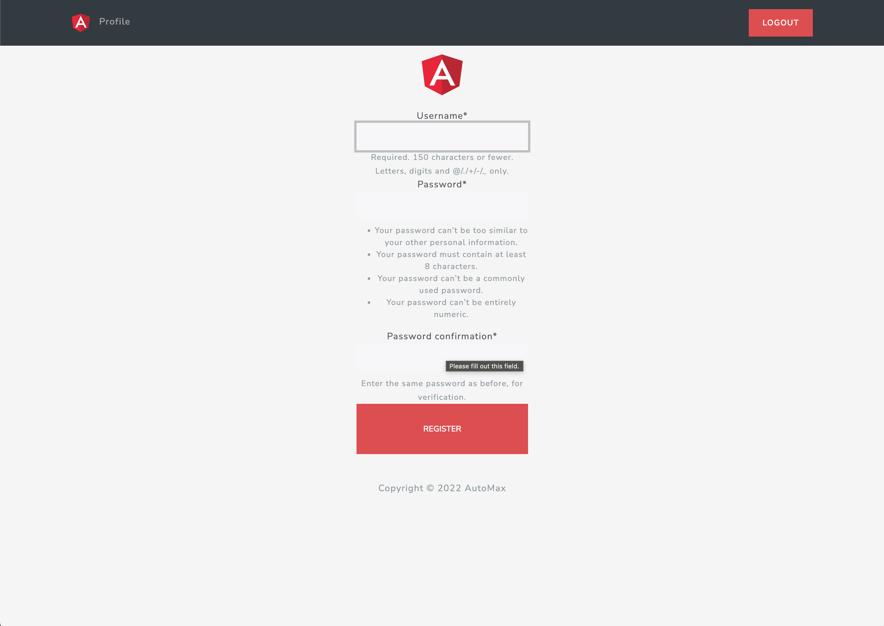
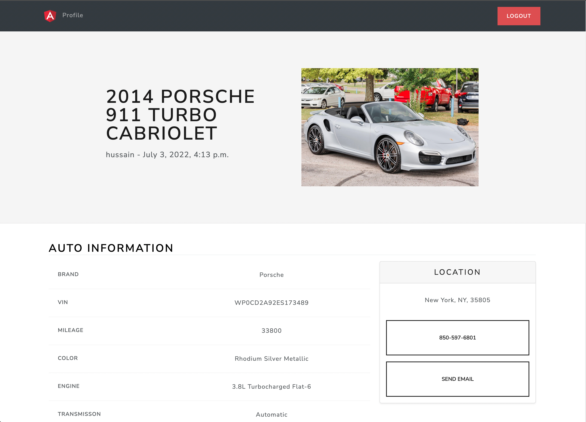
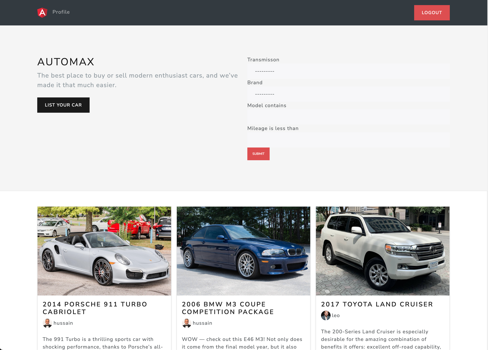

## The Complete Django & Python Webapp

<h1 align="center">Source Code - AutoMax</h1>

 

<a href="https://www.djangoproject.com/">Django</a> Django is a high-level Python web framework that encourages rapid development and clean, pragmatic design. Built by experienced developers, it takes care of much of the hassle of web development, so you can focus on writing your app without needing to reinvent the wheel. It’s free and open source.

### Automax App

